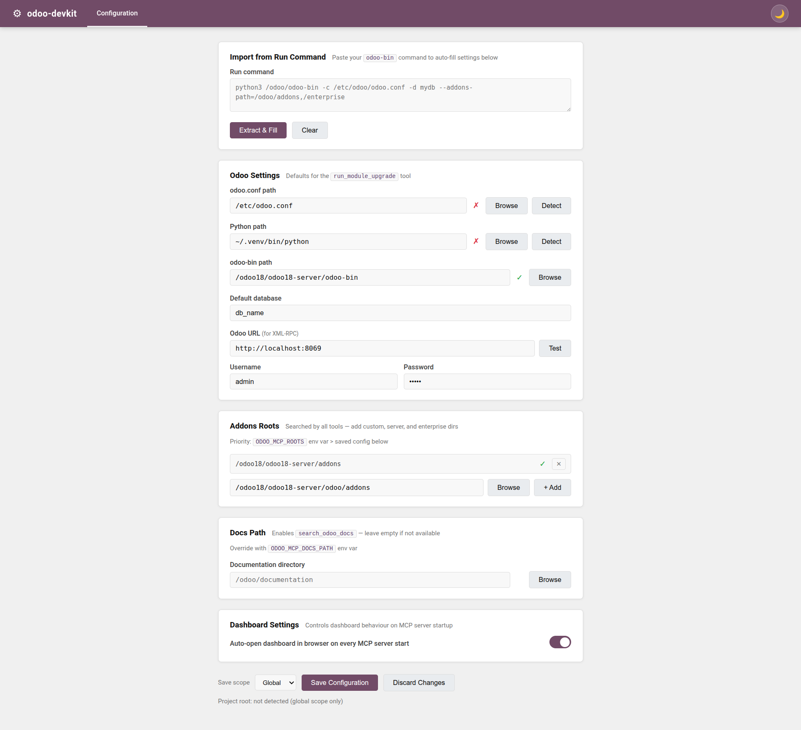

# odoo-devkit

Token-efficient MCP server for Odoo 17/18/19 development.

`odoo-devkit` gives AI assistants structured access to your Odoo codebase for discovery, search, model/view analysis, XML checks, and scaffolding patches.

## Highlights

- Fast module and code discovery across addons roots
- Model surface inspection (fields, methods, views, actions, menus, security)
- View inheritance navigation (`find_view_chain`, inherited views, field usage)
- Patch scaffolding for common Odoo tasks (models, views, actions, menus, security, wizards, reports)
- XML validation for view structure and field references
- Web dashboard that starts with the MCP server (Serena-style flow)
- Layered config: global + project override

## Requirements

- Python 3.10+
- `uv` (recommended)
- `ripgrep` (`rg`) for fast search

Install examples:

```bash
# Ubuntu/Debian
sudo apt install ripgrep

# macOS
brew install ripgrep
```

## Installation

```bash
git clone https://github.com/VatsalChauhan36/odoo-devkit.git
cd odoo-devkit
uv sync
uv run odoo-devkit --help
```

## Configuration

You can configure roots and defaults via environment variables, global config, and project config.

### Config files (Serena-like)

- Global config: `~/.odoo-devkit/config.json`
- Project config: `<project-root>/.odoo-devkit/project.json`

Effective config resolution:

1. Global config
2. Project override (if project root is detected)

Project root detection order:

1. `ODOO_MCP_PROJECT_ROOT`
2. nearest ancestor containing `.odoo-devkit/project.json`
3. nearest ancestor containing `.git`

### Root paths priority

Addons roots are resolved with this priority:

1. `ODOO_MCP_ROOTS`
2. saved config (`roots` in global/project config)

Typical roots order:

1. Custom addons
2. Odoo server addons
3. Odoo base addons

Example:

```bash
export ODOO_MCP_ROOTS="/path/to/custom-addons:/path/to/odoo/addons:/path/to/odoo/odoo/addons"
```

Windows PowerShell:

```powershell
$env:ODOO_MCP_ROOTS = "C:\custom-addons;C:\odoo\addons;C:\odoo\odoo\addons"
```

### Optional docs search

To enable `search_odoo_docs`, set:

```bash
export ODOO_MCP_DOCS_PATH="/path/to/odoo/documentation"
```

## Dashboard flow

The dashboard starts with the MCP server by default.

Saved settings include:

- `open_browser`
- `enable_dashboard`
- `dashboard_host`

CLI overrides:

```bash
uv run odoo-devkit --no-dashboard
uv run odoo-devkit --dashboard-host 0.0.0.0
uv run odoo-devkit --no-open-browser
uv run odoo-devkit --project-root /path/to/project
```

If browser auto-open is skipped (for example, headless Linux), use the MCP tool `open_dashboard`.

## Screenshots

Then this preview will render automatically:



## Deprecated CLI flags

These flags are intentionally kept for backward compatibility and are ignored:

- `--roots`
- `--config`

They emit warnings and do not affect runtime behavior.

## MCP client setup

### Claude Code

```json
{
  "mcpServers": {
    "odoo-devkit": {
      "type": "stdio",
      "command": "uv",
      "args": [
        "run",
        "--directory", "/path/to/odoo-devkit",
        "odoo-devkit",
        "--project-root", "/path/to/your/project"
      ]
    }
  }
}
```

### Cursor

```json
{
  "mcpServers": {
    "odoo-devkit": {
      "command": "uv",
      "args": [
        "run",
        "--directory", "/path/to/odoo-devkit",
        "odoo-devkit",
        "--project-root", "/path/to/your/project"
      ]
    }
  }
}
```

## Tool overview

### Discovery & search

- `list_modules`
- `list_custom_modules`
- `get_module_manifest`
- `get_module_structure`
- `glob_odoo_files`
- `read_file_lines`
- `search_odoo_code`
- `search_odoo_docs`

### Model and view analysis

- `inspect_model_surface`
- `find_model_definition`
- `get_model_fields`
- `find_method_definition`
- `find_view_definition`
- `find_inherited_views`
- `find_view_by_model`
- `find_view_chain`
- `find_field_in_views`
- `validate_view_xml`

### Actions, menus, and security

- `find_action_by_model`
- `find_menu_hierarchy`
- `find_security_access_for_model`

### Scaffolding (patch generation)

- `scaffold_model_patch`
- `scaffold_inherit_model_patch`
- `scaffold_view_inherit_patch`
- `scaffold_views_patch`
- `scaffold_action_patch`
- `scaffold_menu_patch`
- `scaffold_security_access_patch`
- `scaffold_record_rule_patch`
- `scaffold_wizard_patch`
- `scaffold_report_patch`
- `manifest_update_patch`
- `init_update_patch`

### Runtime helpers

- `run_module_upgrade`
- `execute_rpc`
- `check_rpc_connection`
- `open_dashboard`

## Recommended usage pattern

1. Start with `list_custom_modules` and `get_module_structure`
2. Narrow with `search_odoo_code` (`module_filter`, `glob`)
3. Use `inspect_model_surface` for model-level orientation
4. Use view tools for inheritance-aware XML navigation
5. Use scaffold tools to generate safe patches before applying

## Troubleshooting

### `No valid roots found`

Set `ODOO_MCP_ROOTS` or save roots in dashboard config (global/project).

### `rg: command not found`

Install ripgrep (`ripgrep` package).

### Dashboard did not open

- Check `open_browser` setting
- Use `--open-browser` to force when supported
- On headless Linux, open URL manually or call `open_dashboard`

### MCP client cannot connect

- Verify path in `--directory`
- Re-run `uv sync`
- Run `uv run odoo-devkit --help` locally

## License

MIT. See [LICENSE](LICENSE).
